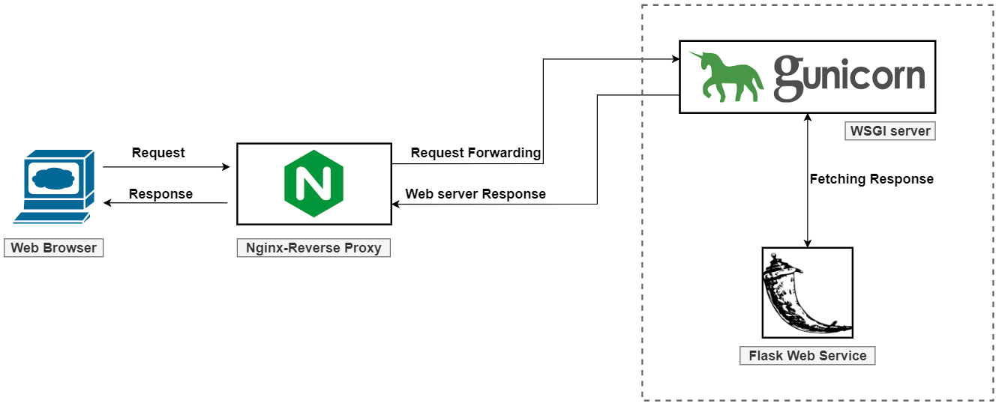
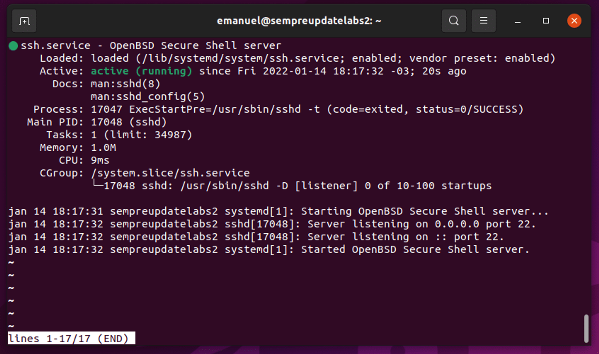
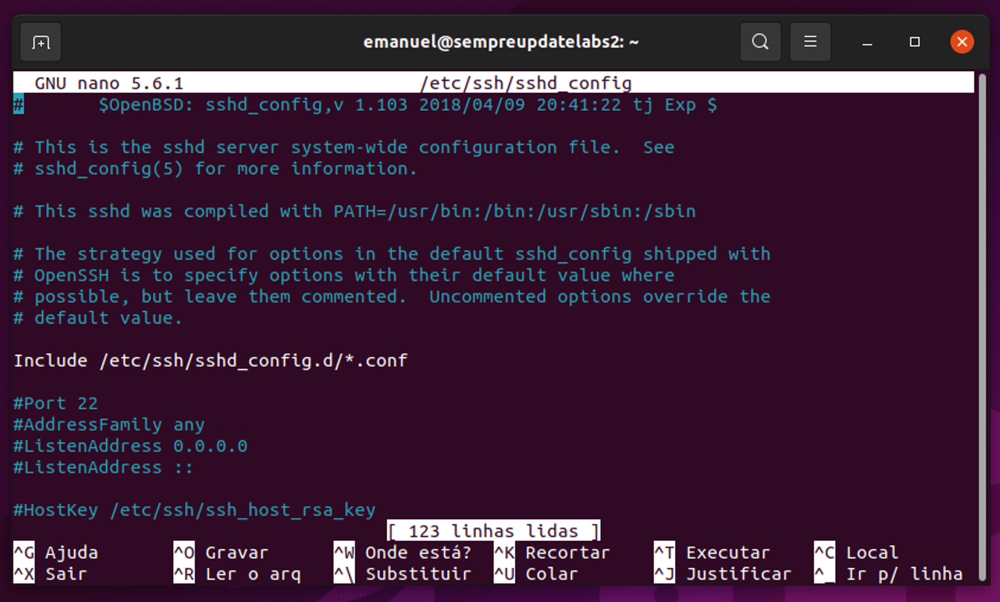

<!--  -->

<h1 align="center">
    
</h1>

# Configurando o servidor Ubuntu-Serve para Python - Flask

Abaixo, temos alguns passos fundamentais para que dê certo o deploy da aplicação Flask. Os procedimentos abaixo foram extraídos dos seguintes sites:

<aside>

- 1° [Como servir aplicativos Flask com o Gunicorn](https://www.digitalocean.com/community/tutorials/how-to-serve-flask-applications-with-gunicorn-and-nginx-on-ubuntu-20-04-pt)

- 2° [Como servir aplicativos Flask com o Gunicorn e o Nginx](https://www.digitalocean.com/community/tutorials/how-to-serve-flask-applications-with-gunicorn-and-nginx-on-ubuntu-20-04-pt)

</aside>

---

## O servidor configurado está rodando em uma máquina virtual utilizando o VirtualBox. Caso queira replicar o ambiente de teste, aqui tem um tutorial explicando como fazer: **[Ubuntu SERVER - COMO instalar em MENOS de 20 MINUTOS! 😎](https://www.youtube.com/watch?v=3XkHSi0qCkc&t=393s)**

### Sem mais delongas bora iniciar!

<details>
<summary>1° Precisamos instalar e configurar o SSH no servidor.</summary>
<br>
O SSH (Secure Shell) é um protocolo de rede utilizado para acesso remoto seguro a computadores e servidores. Ele permite a comunicação segura entre dois dispositivos através de uma conexão criptografada, sendo amplamente utilizado para administração remota de sistemas, transferência de arquivos e túneis seguros.

Para instalar o SSH digite o seguinte comando no terminal:<br>

```bash
sudo apt install openssh-server
```

Ativando o serviço do SSH no Ubuntu

```bash
sudo service ssh status
```

Se você visualizar algo parecido com a tela abaixo, saiba que o SSH está ativo no Ubuntu.

<h1 align="center">
    
</h1>

Para sair do modo visualização pressione a tecla q de quit para sair.

### 2° Liberando as portas SSH no Firewall UFW do Ubuntu Linux.

Agora, a próxima etapa é liberar a porta do SSH no Ubuntu. Execute o comando abaixo para que a liberação ocorra:

```bash
sudo ufw allow ssh
```

### 3° Configurando o SSH.

Por padrão você já está com o **serviço do SSH ativo**, mas se por algum motivo você queira **alterar as configurações padrão**, é possível. Porém, saiba o que está fazendo. Para **alterar as configurações do SSH** execute o comando abaixo, utilizando o editor de sua preferência:

```bash
sudo nano /etc/ssh/sshd_config
```

Essa é a tela onde você vai conseguir configurar o SSH do jeito que você quiser:

E após fazer as alterações é necessário reiniciar o serviço para que
as alterações entrem em vigor. Para isso, execute o comando abaixo:

```bash
sudo service ssh restart
```

#### Como acessar o Ubuntu via SSH

Agora que já passamos pelo processo de **instalação do SSH no Ubuntu**, Debian e derivados, vamos promover o acesso remoto.

A **sintaxe do SSH** é muito simples, confira:

```bash
ssh usuario@ip-alvo
```

Perceba que você precisa inserir o nome do usuário e o IP remoto, ou
seja, da máquina que você quer acessar. É importante ter o SSH instalado
e ativado na outra máquina, ou não vai funcionar. Por padrão a **porta do SSH é a 22**, mas algumas pessoas alteram a porta e neste caso é preciso informar a porta correta ou não vai funcionar.

A **sintaxe do SSH** informando a porta destino é:

```bash
ssh usuario@ip-alvo -p numerodaporta
```

<details>
<summary>Disponibilizando o acesso ao servidor </summary>
<br>

1° Caso não tenha o SSH instaldo é nescessário a intalação SSH

```bash
sudo apt install openssh-server
```

2° Iniciando o SSH

```bash
sudo service ssh start
```

3° Para visualizar os dados do server com IP, basta digitar o seguinte comando

```bash
ifconfig
```

💡 Caso o corra o erro de comando não encontrado basta efetuar a instalação do seguinte pacote

```bash
sudo apt install net-tools
```

Rode novamente o comando: ifconfig

💡 Para alterar para o usuário root basta digitar

1° Caso não tenha configurado uma senha digite o comando abaixo:

```bash
sudo passwd root
```

2° Altere para o usuário root com o comando abaixo:

```bash
su -
```

3° Digite a senha cadastrado na atapa 1°.

</details>

</details>

<details>
<summary>2° Instalar o Nginx </summary>
<br>

O [Nginx](https://www.nginx.com/) é um dos servidores Web mais populares no mundo e é responsável por hospedar alguns dos sites de maior tráfego na Internet. Ele é uma escolha leve que pode ser usado como servidor web ou proxy reverso.

Neste guia, vamos discutir como instalar o Nginx em seu servidor Ubuntu 20.04, ajustar o firewall, gerenciar o processo do Nginx e configurar os blocos de servidor para hospedar mais de um domínio em um único servidor.

### **Passo 1 - Instalando o Nginx**

```bash
sudo apt install nginx
```

### Passo 2 — Como ajustar o Firewall

Antes de testar o Nginx, o software de firewall precisa ser ajustado
para permitir o acesso ao serviço. O Nginx registra-se como um serviço
com o `ufw` após a instalação, tornando-simples permitir o acesso ao Nginx

Liste as configurações do aplicativo com as quais o `ufw` sabe trabalhar digitando:

```bash
sudo ufw app list
```

Você deve obter uma lista dos perfis dos aplicativos:

```bash
Output
Available applications:
  Nginx Full
  Nginx HTTP
  Nginx HTTPS
  OpenSSH

```

Como indicado pela saída, há três perfis disponíveis para o Nginx:

**Nginx Full**:
Este perfil abre ambas as portas 80 (tráfego Web normal, não criptografado) e 443 (tráfego TLS/SSL criptografado)

---

**Nginx HTTP**: Este perfil abre apenas a porta 80 (tráfego Web normal, não criptografado)

---

**Nginx HTTPS**: Este perfil abre apenas a porta 443 (tráfego TLS/SSL criptografado)

---

É recomendável que você habilite o perfil mais restritivo que ainda assim permitirá o tráfego que você configurou. Agora, precisaremos apenas permitir o tráfego na porta 80.

Permita isso digitando:

```bash
sudo ufw allow 'Nginx HTTP'
```

Você pode verificar a mudança digitando:

```bash
sudo ufw status
```

A saída indicará qual tráfego HTTP é permitido:

```
Output
Status: active

To                         Action      From
--                         ------      ----
OpenSSH                    ALLOW       Anywhere
Nginx HTTP                 ALLOW       Anywhere
OpenSSH (v6)               ALLOW       Anywhere (v6)
Nginx HTTP (v6)            ALLOW       Anywhere (v6)
```

Caso o status retornado seja:
`Status: inactive`

Devemos digitar o seguinte comando para habilitar o firewall:

```bash
sudo ufw enable
```

A saída será parecida com a seguinte:


Com isso o trafego na porta 80 deve ser habilitado.

Resolução retirada da documentação: **[ufw - Firewall sem complicações](https://ubuntu.com/server/docs/security-firewall)**

### **Passo 3 — Verificando seu Servidor Web**

No final do processo de instalação, o Ubuntu 20.04 inicia o Nginx. O servidor Web já deve estar em funcionamento.

Podemos verificar com o sistema init `systemd` para garantir que o serviço esteja funcionando digitando:

```bash
systemctl status nginx
```

```
Output
● nginx.service - A high performance web server and a reverse proxy server
   Loaded: loaded (/lib/systemd/system/nginx.service; enabled; vendor preset: enabled)
   Active:active (running) since Fri 2020-04-20 16:08:19 UTC; 3 days ago
     Docs: man:nginx(8)
 Main PID: 2369 (nginx)
    Tasks: 2 (limit: 1153)
   Memory: 3.5M
   CGroup: /system.slice/nginx.service
           ├─2369 nginx: master process /usr/sbin/nginx -g daemon on; master_process on;
           └─2380 nginx: worker process
```

Como confirmado por esta saída, o serviço foi iniciado com sucesso.
No entanto, a melhor maneira de realmente testar isso é solicitando uma página do Nginx.

Você pode acessar a página de inicial padrão do Apache para confirmar que o software está funcionando corretamente navegando para o endereço IP do seu servidor: Se você não sabe o endereço IP do seu servidor, você pode encontrá-lo usando a ferramenta [icanhazip.com](http://icanhazip.com/), que lhe dará o endereço IP público conforme recebido a partir de outro local na Internet:

```bash
curl -4 icanhazip.com
```

Você deve receber a página inicial padrão do Nginx:


Se você estiver nesta página, seu servidor está funcionando corretamente e está pronto para ser gerenciado.

---

### **Passo 4 — Gerenciando o processo do Nginx**

Agora que você tem seu servidor Web em funcionamento, vamos rever alguns comandos básicos de gerenciamento.

Para parar seu servidor Web, digite:

```bash
sudo systemctl stop nginx
```

Para iniciar o servidor quando ele estiver parado, digite:

```bash
sudo systemctl start nginx
```

Para parar e então iniciar o serviço novamente, digite:

```bash
sudo systemctl restart nginx
```

Se você estiver simplesmente fazendo alterações de configuração, o
Nginx geralmente pode recarregar sem quedas na conexão. Para fazer isso, digite:

```bash
sudo systemctl reload nginx
```

Por padrão, o Nginx está configurado para iniciar automaticamente
quando o servidor for iniciado. Se isso não é o que você quer, é
possível desativar este comportamento digitando:

```bash
sudo systemctl disable nginx
```

Para reativar o serviço para iniciar no boot, digite:

```bash
sudo systemctl enable nginx
```

Agora, você aprendeu os comandos básicos de gerenciamento e deve
estar pronto para configurar o site para hospedar mais de um domínio.

### **Passo 5 — Configurando Blocos do Servidor (Recomendado)**

Ao usar o servidor Web Nginx, os _server blocks_ (similares aos
hosts virtuais no Apache) podem ser usados para encapsular detalhes de
configuração e hospedar mais de um domínio de um único servidor. Vamos
configurar um domínio chamado **your_domain**, mas você deve **substituí-lo por seu próprio nome de domínio**.

O Nginx no Ubuntu 20.04 tem um bloco de servidor habilitado por padrão que está configurado para exibir documentos do diretório `/var/www/html`.
Enquanto isso funciona bem para um único site, ele pode tornar-se
indevido se você estiver hospedando vários sites. Em vez de modificar o `/var/www/html`, vamos criar uma estrutura de diretórios dentro do `/var/www` para nosso site **your_domain**, deixando o `/var/www/html` intacto como o diretório padrão a ser servido se um pedido de cliente não corresponder a nenhum outro site.

Crie o diretório para o **your_domain** da seguinte forma, utilizando o sinalizador `-p` para criar quaisquer diretórios pai necessários:

```bash
sudo mkdir -p /var/www/your_domain/html
```

Em seguida, atribua a posse do diretório com a variável de ambiente `$USER`:

```bash
sudo chown -R $USER:$USER /var/www/your_domain/html
```

As permissões dos seus web roots devem estar corretas se você não tiver modificado seu valor de `umask`, que define permissões padrão de arquivos. Para garantir que suas
permissões estejam corretas e permitam que o proprietário leia, escreva e execute os arquivos, enquanto concede apenas permissões de leitura e execução para grupos e outros, você pode digitar o seguinte comando:

```bash
sudo chmod -R 755 /var/www/your_domain
```

A seguir, crie uma página de amostra `index.html` utilizando o `nano` ou seu editor favorito:

```bash
nano /var/www/your_domain/html/index.html
```

Dentro, adicione a seguinte amostra HTML:

/var/www/your_domain/html/index.html

```html
<html>
  <head>
    <title>Welcome to your_domain!</title>
  </head>
  <body>
    <h1>Success! The your_domain server block is working!</h1>
  </body>
</html>
```

Salve e feche o arquivo digitando `CTRL` e `X`, depois `Y` e `ENTER` quando você terminar.

Para que o Nginx exiba este conteúdo, é necessário criar um bloco de
servidor com as diretivas corretas. Em vez de modificar o arquivo de
configuração padrão diretamente, vamos fazer um novo em `/etc/nginx/sites-available/example.com`:

```bash
sudo nano /etc/nginx/sites-available/your_domain
```

Cole no seguinte bloco de configuração, que é similar ao padrão, mas atualizado para nosso novo diretório e nome de domínio:

/etc/nginx/sites-available/your_domain

```markup
server {
        listen 80;
        listen [::]:80;

        root /var/www/your_domain/html;
        index index.html index.htm index.nginx-debian.html;

        server_nameyour_domain www.your_domain;

        location / {
                try_files $uri $uri/ =404;
        }
}

```

Note que atualizamos a configuração do `root` para nosso novo diretório e o `server_name` para nosso nome de domínio.

Em seguida, vamos habilitar o arquivo criando um link dele para o diretório `sites-enabled`, de onde o Nginx lê durante a inicialização:

```bash
sudo ln -s /etc/nginx/sites-available/your_domain /etc/nginx/sites-enabled/
```

Agora, dois blocos de servidor estão habilitados e configurados para responder às solicitações baseados em suas diretivas `listen` e `server_name` (você pode ler mais sobre como o Nginx processa essas diretivas [aqui](https://www.digitalocean.com/community/tutorials/understanding-nginx-server-and-location-block-selection-algorithms)):

- `your_domain`: irá responder às solicitações para `your_domain` e `www.your_domain`.
- `default`: responderá a quaisquer pedidos na porta 80 que não correspondam aos outros dois blocos.

Para evitar um possível problema de memória de hash que possa surgir
ao adicionar nomes adicionais de servidor, é necessário ajustar um valor
único no arquivo `/etc/nginx/nginx.conf`. Abra o arquivo:

```bash
sudo nano /etc/nginx/nginx.conf
```

Encontre a diretiva `server_names_hash_bucket_size` e remova o símbolo `#` para descomentar a linha: Se você estiver usando o nano, você pode procurar rapidamente por palavras no arquivo pressionando `CTRL` e `w`.

/etc/nginx/nginx.conf

```
...
http {
    ...
    server_names_hash_bucket_size 64;
    ...
}
...
```

Salve e feche o arquivo quando você terminar.

Em seguida, teste para garantir que não haja erros de sintaxe em qualquer um dos seus arquivos do Nginx:

```bash
sudo nginx -t
```

Se não houver problemas, reinicie o Nginx para habilitar suas alterações:

```bash
sudo systemctl restart nginx
```

O Nginx agora deve estar exibindo seu nome de domínio. Você pode testar isso navegando para `http://your_domain`, onde você deve ver algo assim:


---

### **Passo 6 — Familiarizando-se com arquivos e diretórios importantes do Nginx**

Agora que sabe como gerenciar o serviço do Nginx, você deve gastar
alguns minutos para familiarizar-se com alguns diretórios e arquivos
importantes.

### [Conteúdo](https://www.digitalocean.com/community/tutorials/how-to-install-nginx-on-ubuntu-20-04-pt#conteudo)

- `/var/www/html`: O conteúdo Web em si, que por padrão apenas consiste na página Nginx padrão que você viu antes, é servido fora do diretório `/var/www/html`. Isso pode ser alterado mudando os arquivos de configuração do Nginx.

### [Configuração do Servidor](https://www.digitalocean.com/community/tutorials/how-to-install-nginx-on-ubuntu-20-04-pt#configuracao-do-servidor)

- `/etc/nginx`: o diretório de configuração do Nginx. Todos os arquivos de configuração do Nginx residem aqui.
- `/etc/nginx/nginx.conf`: o arquivo de configuração principal do Nginx. Isso pode ser modificado para fazer alterações na configuração global do Nginx.
- `/etc/nginx/sites-available/`: o diretório onde os blocos de servidor de cada site podem ser armazenados. O Nginx não usará os
  arquivos de configuração encontrados neste diretório a menos que estejam ligados ao diretório `sites-enabled`. Normalmente, todas as
  configurações de blocos de servidor são feitas neste diretório e então
  habilitadas pela ligação a outro diretório.
- `/etc/nginx/sites-enabled/`: o diretório onde os blocos
  de servidor de cada site habilitados são armazenados. Normalmente, eles
  são criados pela ligação aos arquivos de configuração encontrados no
  diretório `sites-available`.
- `/etc/nginx/snippets`: este diretório contém fragmentos
  de configuração que podem ser incluídos em outro lugar na configuração
  do Nginx. Os segmentos de configuração potencialmente repetíveis são
  bons candidatos à refatoração em snippets.

### [Registros do Servidor](https://www.digitalocean.com/community/tutorials/how-to-install-nginx-on-ubuntu-20-04-pt#registros-do-servidor)

- `/var/log/nginx/access.log`: cada pedido ao seu servidor
  Web é registrado neste arquivo de registro a menos que o Nginx esteja
  configurado para fazer de outra maneira.
- `/var/log/nginx/error.log`: qualquer erro do Nginx será gravado neste registro.

</details>

<details>
<summary>3° Configurando Ubuntu-Server para API-Flask </summary>
<br>

### **Pré-requisitos**

Um servidor com o Ubuntu /Debian instalado e um usuário não root com privilégios sudo.

O Nginx instalado

### **Passo 1 — Instalando os componentes dos repositórios do Ubuntu**

Nosso primeiro passo será instalar todas as partes que precisamos dos repositórios do Ubuntu. Isso inclui o `pip`, o gerenciador de pacotes Python que irá gerenciar nossos componentes Python. Também vamos obter os arquivos de desenvolvimento do Python
necessários para construir alguns dos componentes do Gunicorn.

Primeiramente, vamos atualizar o índice local de pacotes e instalar
os pacotes que irão nos permitir construir nosso ambiente Python. Estes
incluem o `python3-pip`, junto com alguns outros pacotes e ferramentas de desenvolvimento necessários para um ambiente de programação robusto:

```bash
sudo apt update
sudo apt install python3-pip python3-dev build-essential libssl-dev libffi-dev python3-setuptools

```

Com esses pacotes instalados, vamos seguir em frente para criar um ambiente virtual para nosso projeto.

### **Passo 2 — Criando um Ambiente Virtual em Python**

Em seguida, vamos configurar um ambiente virtual para isolar nosso aplicativo Flask dos outros arquivos Python no sistema.

Inicie instalando o pacote `python3-venv`, que instalará o módulo `venv`:

```bash
sudo apt install python3-venv
```

Em seguida, vamos fazer um diretório pai para nosso projeto Flask. Acesse o diretório após criá-lo:

```bash
mkdir ~/myprojectcd ~/myproject
```

Crie um ambiente virtual para armazenar os requisitos Python do projeto Flask digitando:

```bash
python3 -m venvmyprojectenv
```

Isso instalará uma cópia local do Python e do `pip` em um diretório chamado `myprojectenv` dentro do diretório do seu projeto.

Antes de instalar aplicativos no ambiente virtual, você precisa ativá-lo. Faça isso digitando:

```bash
sourcemyprojectenv/bin/activate
```

Seu prompt mudará para indicar que você agora está operando no ambiente virtual. Ele se parecerá com isso:

```
(myprojectenv)user@host:~/myproject$
```

### Passo 3 — Configurando um aplicativo Flask

Agora que você está no seu ambiente virtual, instale o Flask e o Gunicorn e comece a projetar seu aplicativo.

Primeiramente, vamos instalar o `wheel` com a instância local do `pip` para garantir que nossos pacotes sejam instalados mesmo se estiverem faltando arquivos wheel:

```bash
pip install wheel
```

<aside>
💡 Nota:

Independentemente da versão do Python que você estiver usando, quando o ambiente virtual for ativado, você deve usar o comando `pip` (não o `pip3`).

</aside>

Em seguida, vamos instalar o Flask e o Gunicorn:

```bash
pip install gunicorn flask
```

### Criando um app de exemplo

Agora que você tem o Flask disponível, você pode criar um aplicativo
simples. O Flask é um microframework. Ele não inclui muitas das
ferramentas que os frameworks mais completos talvez tenham. Ele existe,
principalmente, como um módulo que você pode importar para seus projetos
para ajudá-lo na inicialização de um aplicativo Web.

Embora o seu aplicativo possa ser mais complexo, vamos criar nosso app Flask em um único arquivo, chamado `myproject.py`:

```bash
nano ~/myproject/myproject.py
```

O código do aplicativo ficará neste arquivo. Ele importará o Flask e instanciará um objeto Flask. Você pode usar isto para definir as funções que devem ser executadas quando uma rota específica for solicitada:

~/myproject/myproject.py

```python
from flask import Flask
app = Flask(__name__)

@app.route("/")
def hello():
    return "<h1 style='color:blue'>Hello There!</h1>"

if __name__ == "__main__":
    app.run(host='0.0.0.0')

```

Isso define basicamente qual conteúdo apresentar quando o domínio raiz for
acessado. Salve e feche o arquivo quando você terminar.

Se você seguiu o guia de configuração inicial do servidor, você
deverá ter um firewall UFW ativado. Para testar o aplicativo, será
necessário permitir o acesso à porta `5000:`

```bash
sudo ufw allow 5000
```

Agora é possível testar seu app Flask digitando:

```bash
pythonmyproject.py
```

Você verá um resultado como o seguinte, incluindo um aviso útil lembrando
para não usar essa configuração de servidor na produção:

```
Output
* Serving Flask app "myproject" (lazy loading)
 * Environment: production
   WARNING: Do not use the development server in a production environment.
   Use a production WSGI server instead.
 * Debug mode: off
 * Running on http://0.0.0.0:5000/ (Press CTRL+C to quit)
```

Visite o endereço IP do seu servidor seguido de `:5000` no seu navegador Web:

```
http://your_server_ip:5000
```

Você deve ver algo como isto:


Quando terminar, tecle `CTRL-C` na janela do seu terminal para parar o servidor de desenvolvimento Flask.

### **Criando o ponto de entrada da WSGI**

Em seguida, vamos criar um arquivo que servirá como o ponto de entrada para nosso aplicativo. Isso dirá ao nosso servidor do Gunicorn como interagir com o aplicativo.

Vamos chamar o arquivo de `wsgi.py`:

```bash
nano ~/myproject/wsgi.py
```

Neste arquivo, vamos importar a instância Flask do nosso aplicativo e então executá-lo:

~/myproject/wsgi.py

```python
from myproject import app

if __name__ == "__main__":
    app.run()

```

Salve e feche o arquivo quando você terminar.

Com isso você já tem seu servidor configura e rodando sua aplicação 🌐🚀

</details>
<br>

**O tutorial acima originalmente pertence à página: [DigitalOcean](https://www.digitalocean.com/)**. Durante sua elaboração, foram realizadas algumas alterações e correções de `bugs` que surgiram durante a configuração. Isso permitiu que eu fornecesse um material mais atualizado e com suporte adicional.

- Resolução de erros ufw: [ufw - Firewall sem complicações](https://ubuntu.com/server/docs/security-firewall)
